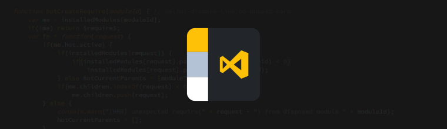
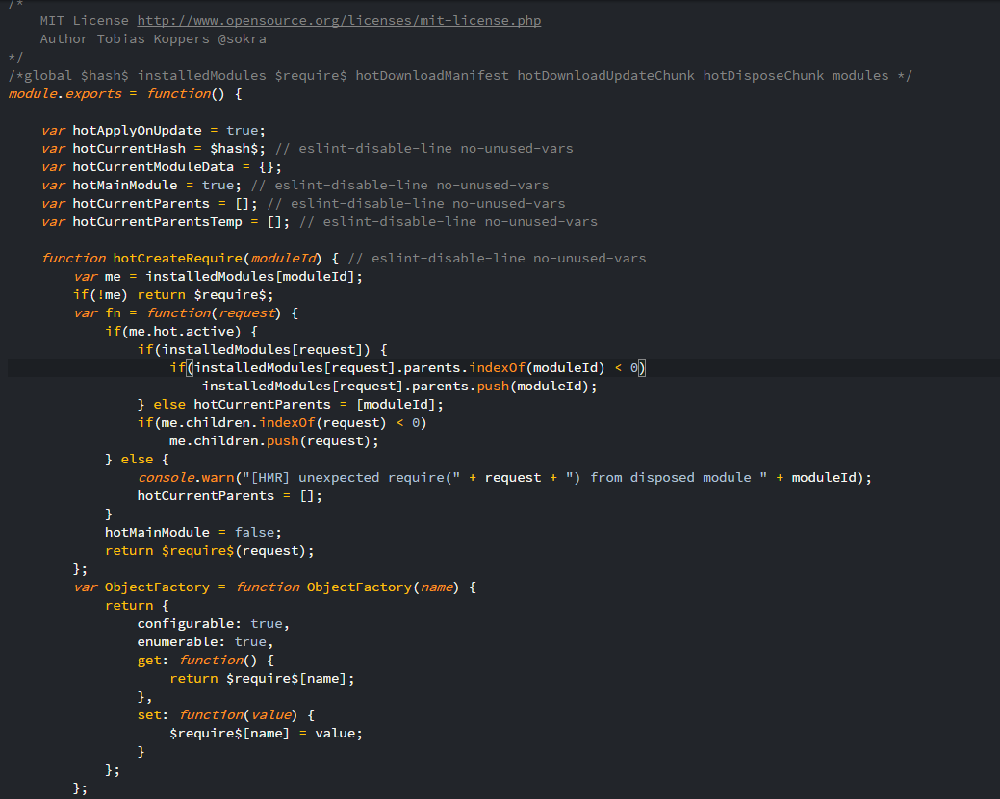

# Smooth Yellow Theme

## Features

Visual Studio code syntax theme featuring a smooth golden yellow with a contrasting dark background.

Languages:
* HTML
* CSS
* Javascript and variants
* etc.. 

If there's missing syntax or improvements to be made let me know or make a pull request and I'll add it.

Future features:
* Workbench theming (Once the 1.11+ workbench theming API is finished)

